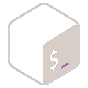

# Hi there, I'm Victor A Balderas👋

[][youtube]
[][follow]

## I'm a Student and  Developer

- 🌱 I’m currently learning everything 🤣
- 🥅 2022 Goals: Learn more languages & contribute more!!
- ⚡ Fun fact: I love to draw and play guitar / piano and other instruments

### Connect with me

&nbsp;&nbsp;

&nbsp;&nbsp;

&nbsp;&nbsp;

### Languages and Tools

  
  &nbsp;&nbsp;

  
  &nbsp;&nbsp;

  
  &nbsp;&nbsp;

  
  &nbsp;&nbsp;

  
  &nbsp;&nbsp;

  
  &nbsp;&nbsp;

  
  &nbsp;&nbsp;

  
  &nbsp;&nbsp;

  
  &nbsp;&nbsp;

  
  &nbsp;&nbsp;

  
:zap: GitHub Stats

    

      
      
    

[follow]: https://twitter.com/intent/follow?original_referer=https%3A%2F%2Fgithub.com%2FVbalder7&screen_name=Dr_Balders
[twitter]: https://twitter.com/Dr_Balders
[youtube]: https://youtube.com/channel/UCl-kp7DBD2Q5l6WEYrb2_OQ
[instagram]: https://instagram.com/victorbalderas1/
[linkedin]: https://linkedin.com/in/victor-balderas
